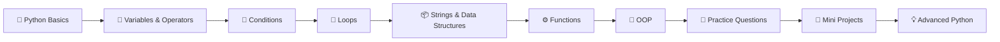
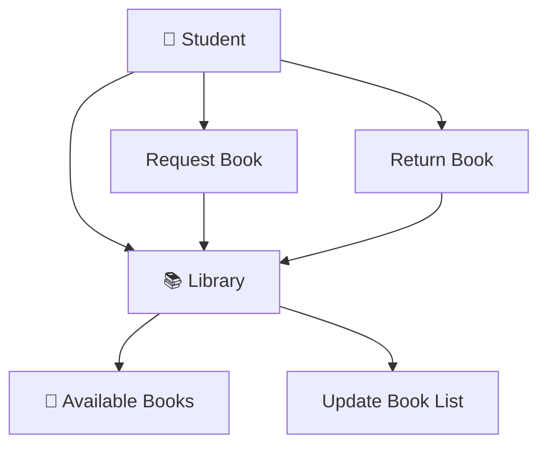

<div align="center">

# 🐍 Pythonnnn

### A structured Python learning repository — from first programs to OOP and practical projects.

<p>
  
  
  
  
  
</p>

<p>
  <a href="https://github.com/injmam-ansarii/Pythonnnn">Repository</a> •
  <a href="https://github.com/injmam-ansarii/Pythonnnn/tree/main/Project%201">Projects</a> •
  <a href="https://github.com/injmam-ansarii/Pythonnnn/tree/main/class%2001">Class Practice</a>
</p>

</div>

---

## 📌 About

**Pythonnnn** is a personal Python learning and practice repository containing class exercises, practice questions, chapter-wise notes, cheat sheets, and small console-based projects.

The repository is intentionally organized around **learning by doing**: concepts are introduced through small programs, reinforced with practice questions, and then applied in projects.

It is useful as a personal learning archive, revision resource, and starting point for building stronger Python skills for **backend development, automation, cybersecurity, scripting, and AI/ML**.

> 🎯 **Learning philosophy:** Understand → Code → Practice → Build → Improve

---

## ✨ What's Inside

| Section | What you'll find |
|---|---|
| 📚 **ChapterWise Notes** | Concept notes and practice sets organized by chapter |
| 🧑‍💻 **Class Practice** | Python programs written while learning individual concepts |
| 🧪 **Practice Questions** | Small problem-solving exercises |
| 🚀 **Projects** | Three beginner-friendly practical Python projects |
| 📄 **Cheat Sheet** | Quick revision reference |
| 🎓 **Lecture Notes** | Lecture-wise Python learning material |

### Repository snapshot

- 🐍 **46 Python source files**
- 📄 **42 PDF learning/notes files**
- 🚀 **3 practical projects**
- 🧩 **7 class-practice folders**
- 📖 **13 chapter folders**
- 📝 Practice sets + lecture material + cheat sheet

---

## 🗺️ Learning Roadmap



The repository follows a gradual progression rather than treating Python as a collection of unrelated programs.

---

## 📂 Repository Structure

```text
Pythonnnn/
│
├── 📚 00 python notess/
│   ├── ChapterWise Notes/
│   │   ├── Chapter 0/
│   │   ├── Chapter 1/
│   │   ├── Chapter 2/
│   │   ├── ...
│   │   ├── Chapter 13/
│   │   ├── Project 1/
│   │   ├── Project 2/
│   │   └── Project 3/
│   │
│   ├── Lecture1_py.pdf
│   ├── Lecture2_py.pdf
│   ├── ...
│   └── Python Cheatsheet.pdf
│
├── 🧪 class 01/
├── 🧪 class 02/
├── 🧪 class 03/
├── 🧪 class 04/
├── 🧪 class 05/
├── 🧪 class 06/
├── 🧪 class 07/
│
├── 🚀 Project 1/
│   ├── main.py
│   └── Project 1.pdf
│
├── 🚀 Project 2/
│   ├── main.py
│   ├── hiscore.txt
│   └── Project 2.pdf
│
├── 🚀 Project 3/
│   ├── main.py
│   ├── index.html
│   └── Project 3.pdf
│
├── 📄 README.md
├── .gitignore
└── .gitattributes
```

---

# 🧠 Topics Covered

## 01 — Python Fundamentals

The early practice programs cover the foundations needed to start writing Python confidently:

- Variables and data types
- Input and output
- Type conversion
- Arithmetic operators
- Relational operators
- Basic expressions
- Simple programs and problem solving

---

## 02 — Conditional Statements

Practice with decision-making logic:

```python
if
elif
else
```

Examples include:

- Comparisons
- Multiple conditions
- Relational operators
- Basic decision-based programs

---

## 03 — Strings

The repository contains practice around:

- String indexing
- String slicing
- String manipulation
- User input
- Basic string operations

Example:

```python
name = "Python"

print(name[0])
print(name[1:4])
```

---

## 04 — Lists, Tuples, Sets & Dictionaries

Data structures are practiced through dedicated exercises covering concepts such as:

- Lists
- Dictionaries
- Nested dictionaries
- Sets
- Union
- Intersection
- Set methods

These concepts are essential for writing practical Python programs.

---

## 05 — Loops

Loop-based problem solving includes:

- `for` loops
- `while` loops
- `break`
- `continue`
- Repetition and iteration
- Basic numerical problems

Example:

```python
for i in range(1, 6):
    print(i)
```

---

## 06 — Functions

The repository also contains function-based exercises covering:

- Function definition
- Function calls
- Parameters
- Return values
- Reusable logic
- Practice problems

Example:

```python
def add(a, b):
    return a + b

print(add(10, 20))
```

---

## 07 — Object-Oriented Programming

The chapter-wise material progresses into OOP concepts, including practical examples involving:

- Classes
- Objects
- Methods
- Constructors
- Encapsulation
- Inheritance
- Polymorphism
- OOP-based problem solving

---

# 🚀 Mini Projects

The repository includes three practical projects that apply the concepts learned throughout the exercises.

---

## 🎮 Project 1 — Snake, Water & Gun

A simple console game based on the classic **Snake, Water & Gun** concept.

### How it works

```text
                ┌───────────────┐
                │     START     │
                └───────┬───────┘
                        ↓
              ┌───────────────────┐
              │ Computer chooses  │
              │ S / W / G         │
              └─────────┬─────────┘
                        ↓
              ┌───────────────────┐
              │ Player chooses    │
              │ S / W / G         │
              └─────────┬─────────┘
                        ↓
              ┌───────────────────┐
              │ Compare choices   │
              └─────────┬─────────┘
                        ↓
             ┌──────────┼──────────┐
             ↓          ↓          ↓
          🏆 Win      🤝 Tie     ❌ Lose
```

### Concepts used

- `random`
- Functions
- Conditional statements
- User input
- Boolean logic

### Run

```bash
python "Project 1/main.py"
```

---

## 🔢 Project 2 — Number Guessing Game

A console-based number guessing game where the computer generates a random number between **1 and 100**.

The player continues guessing until the correct number is found.

### Features

- Random number generation
- User guesses
- Higher/lower hints
- Guess counter
- High-score tracking using `hiscore.txt`

### Flow

```text
START
  ↓
Generate random number
  ↓
Ask player for guess
  ↓
Compare guess
  ├── Too High → Guess Again
  ├── Too Low  → Guess Again
  └── Correct  → Finish
                  ↓
             Check High Score
                  ↓
                 END
```

### Concepts used

- `random`
- `while` loop
- Conditional statements
- File handling
- Variables
- User input

### Run

```bash
python "Project 2/main.py"
```

> **Note:** Run this project from its project directory so `hiscore.txt` is found correctly.

---

## 📚 Project 3 — Central Library

A simple object-oriented library management simulation.

The program models a **Library** and a **Student** and provides a menu-driven interface.

### Features

- Display available books
- Request/borrow a book
- Return a book
- Track currently available books
- Menu-driven interaction

### Architecture



### Concepts used

- Classes and objects
- Constructors
- Methods
- Lists
- Loops
- Conditional statements
- User input
- Object-oriented design

### Run

```bash
python "Project 3/main.py"
```

---

# 🧪 Class Practice

The `class 01` → `class 07` directories contain smaller programs created while learning individual concepts.

### Example progression

```text
class 01
   ↓
Basic Programs
   ↓
class 02
   ↓
Conditions + Strings
   ↓
class 03
   ↓
Practice Questions
   ↓
class 04
   ↓
Dictionaries + Sets
   ↓
class 05
   ↓
Loops
   ↓
class 06
   ↓
Functions
   ↓
class 07
   ↓
Further Practice
```

This structure makes it easier to revisit a specific topic without searching through one large source file.

---

# 📖 Study Resources

Inside `00 python notess/`, the repository contains a dedicated collection of learning material.

### 📘 ChapterWise Notes

Chapter-wise PDFs cover the learning material from **Chapter 0 through Chapter 13**, with practice sets for many chapters.

### 🎓 Lecture Notes

Lecture-wise PDFs are included for quick revision:

```text
Lecture 1
Lecture 2
Lecture 3
...
Lecture 8
```

### ⚡ Python Cheat Sheet

A dedicated:

```text
Python Cheatsheet.pdf
```

is included for quick reference and revision.

---

# 🛠️ Tech Stack

| Technology | Purpose |
|---|---|
| 🐍 **Python** | Core programming language |
| 🎲 **random** | Random number generation |
| 📁 **File Handling** | High-score persistence |
| 🧱 **OOP** | Library project architecture |
| 🌐 **HTML** | Basic web-related project material |
| 📄 **PDF** | Notes, practice sets and project documentation |
| 🐙 **Git/GitHub** | Version control and repository management |

No external Python package is required for the three main console projects shown in this repository.

---

# ⚙️ Getting Started

## 1. Clone the repository

```bash
git clone https://github.com/injmam-ansarii/Pythonnnn.git
```

## 2. Open the project

```bash
cd Pythonnnn
```

## 3. Check Python

```bash
python --version
```

or:

```bash
python3 --version
```

## 4. Run a practice file

For example:

```bash
python "class 01/firstprogram.py"
```

## 5. Run a project

```bash
python "Project 1/main.py"
```

or:

```bash
python "Project 2/main.py"
```

or:

```bash
python "Project 3/main.py"
```

---

# 💻 Recommended Setup

For the best learning experience:

- **Python 3.x**
- **VS Code**
- **Git**
- **GitHub**
- Python extension for VS Code

### Optional VS Code workflow

```text
Write Code
    ↓
Run
    ↓
Observe Output
    ↓
Find Error
    ↓
Debug
    ↓
Improve
    ↓
Commit to Git
```

---

# 🎯 Why This Repository Exists

This repository is more than a collection of random Python files.

It acts as a **learning timeline** showing the progression from:

> **first Python program → basic logic → data structures → functions → OOP → practical projects**

The goal is to build programming fundamentals strong enough to later work with larger technologies and real-world applications.

---

# 🔐 Future Direction

Python is also useful beyond basic programming. A strong Python foundation can be extended into:

```text
Python
  │
  ├── 🌐 Backend Development
  │      ├── Flask
  │      ├── FastAPI
  │      └── Django
  │
  ├── 🔐 Cybersecurity
  │      ├── Automation
  │      ├── Security Tools
  │      ├── Log Analysis
  │      └── Network Scripting
  │
  ├── 🤖 AI / Machine Learning
  │      ├── NumPy
  │      ├── Pandas
  │      ├── Scikit-learn
  │      └── TensorFlow / PyTorch
  │
  └── ⚙️ Automation & Scripting
         ├── File Automation
         ├── System Scripts
         └── Developer Tools
```

This repository focuses on the **foundation layer** that makes those next steps easier.

---

# 📈 Learning Progress

```text
Python Fundamentals       ████████████████████
Conditions & Loops        ████████████████████
Data Structures           ██████████████████░░
Functions                 ████████████████░░░░
OOP                       ███████████████░░░░░
Projects                  ██████████████░░░░░░
Advanced Python           ██████████░░░░░░░░░░
```

> This progress section is a visual representation of the repository's learning stages, not a formal skill certification.

---

# 🧩 Project Highlights

| Project | Main Concept | Difficulty |
|---|---|---|
| 🎮 Snake, Water & Gun | Logic + Random | 🟢 Beginner |
| 🔢 Number Guessing Game | Loops + File Handling | 🟢 Beginner |
| 📚 Central Library | OOP + Lists | 🟡 Beginner → Intermediate |

---

# 🤝 Contributing

This is primarily a personal learning repository, but suggestions and improvements are welcome.

If you want to contribute:

```bash
git fork
git clone
git checkout -b feature/improvement
git add .
git commit -m "Add improvement"
git push origin feature/improvement
```

Then open a Pull Request.

---

# 📜 License

This repository is primarily intended for **learning and educational purposes**.

If you reuse code or learning material, please give appropriate credit to the original repository.

---

# 👨‍💻 Author

<div align="center">

### **Injmam Ansari**

**BCA Student • Python Learner • Full-Stack Web Development • Cybersecurity**

<p>
  <a href="https://github.com/injmam-ansarii">
    
  </a>
  <a href="https://github.com/injmam-ansarii/Pythonnnn">
    
  </a>
</p>

> **Keep coding. Keep learning. Keep building. 🚀**

</div>

---

<div align="center">

### ⭐ If this repository helps you learn Python, consider giving it a star!

**Made with 🐍 Python + ☕ consistency + 💻 practice**

</div>
